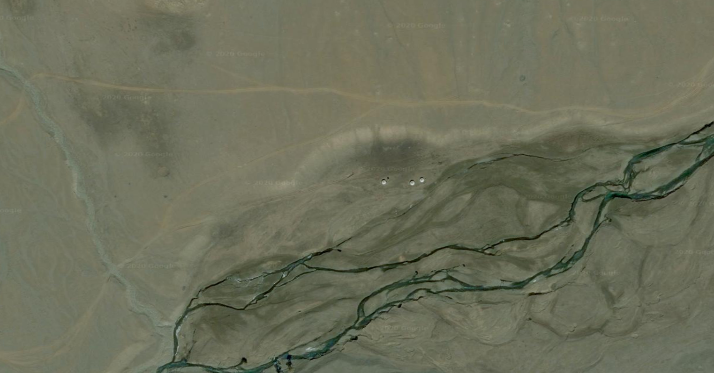
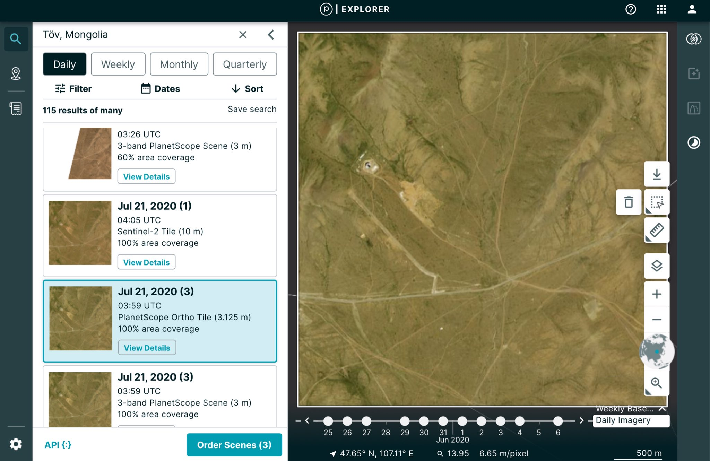
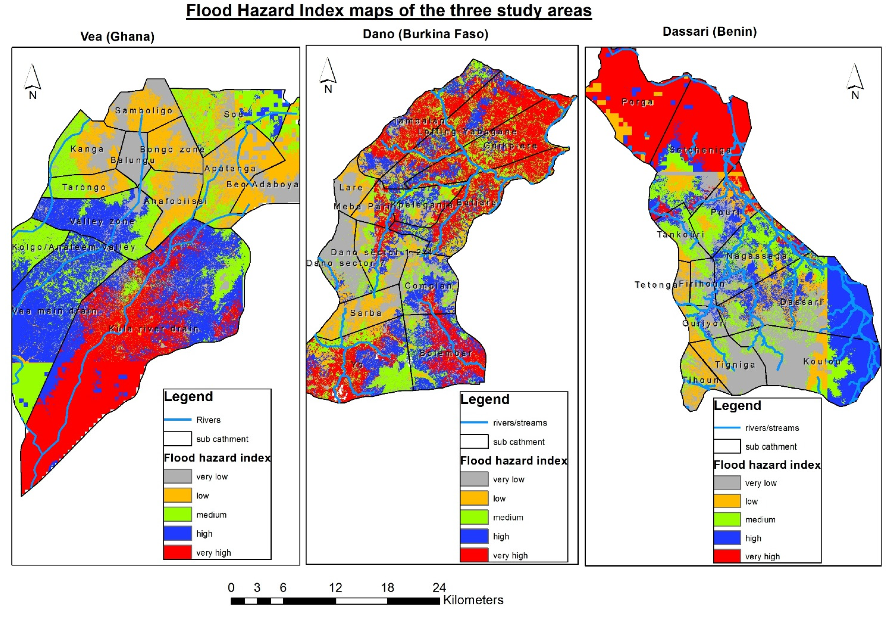

As the least densely populated soverign nation (2 inhabitants per km2), Mongolia has no lack of wide open spaces. Just a few kilometers outside the capital city, Ulaanbaatar, you will find vast expanses of steppe dotted with sheep, goats, cows, and the occasional horse herd. But this space also has a downside. 

Simply put, driving around Mongolia is hard. Mongolia's paved road network is mostly limited to connecting Ulaanbaatar with provincial capitals. Less than [25%](https://www.adb.org/sites/default/files/linked-documents/48186-005-ssa.pdf) of Mongolia's road network is paved. This creates challenges for Mongolia's government, civil society organizations, and private businesses. Obtaining accurate information about activities outside the capital or province capitals is very hard to obtain. Remote sensing techniques are one way to mitigate this challenge. 

[Remote sensing](https://www.usgs.gov/faqs/what-remote-sensing-and-what-it-used#:~:text=Remote%20sensing%20is%20the%20process,sense%22%20things%20about%20the%20Earth.), or the the process of detecting physical characteristics of an area by measuring reflected radiation, can obtain accurate information for a relatively low cost. Remote sensing can take the form of satellite images that look much like a Google Maps image, but images can also contain a lot of information in the non-visible spectrum that can be analyzed for various purposes. In addition, technologies like radar and LIDAR (light detection and ranging **or** light + radar) add to the types of information that can be obtained by satellites. Remote sensing is also not limited to satellites. Drones can be outfitted with similar types of sensors as satellites to gather information at a much finer detail. 

Remote sensing techniques can be used in one area over a period of time for a much lower cost than having a large team gather data on foot. To illustrate how this could be done in Mongolia, I will describe **five ways** remote sensing can be used to solve **real challenges** Mongolia faces. 

## 1. Cheaply monitor agriculture

Mongolia has a long history of producing a limited range of vegetables, wheat, and other cereal crops. However, this domestic production does not always meet domestic demand, especially for wheat. With a short growing season, unpredictable rainfall, and large swings in temperature, Mongolia's agriculture sector faces many challenges with food crops. 

Normalized Difference Vegetation Index (NDVI) is one way to monitor crops cheaply and easily. By utilizing satellite imagery that is readily available, fields can be evaluated for the health of the crops over time. Here is an example of what an NDVI image looks like.

In the above image you can see the darker areas of the image, which would correspond to lower biomass. The higher the value on the scale, generally the healthier the plants. Farms can use this data to target problem spots and generally understand how their fields are producing.

Accessing satellite imagery and performing a weekly NDVI analysis on every farm in Mongolia during the growing season is reasonable and cost effective. Expecting small and medium farm enterprises to accomplish this task is not though. 

This type of analysis requires technical skills in both data engineering and IT infrastructure. Therefore a specialized program or office within the Ministry of Agriculture would be ideal. Given the national importance of meeting domestic demand of vegetables and cereals, it makes sense for the government to support farmers in this way.

## 2. Find illegal mining or construction

Construction and mining are two areas of industry tightly regulated by the Mongolian government. Nevertheless, both illegal construction and illegal mining are considered to be relatively common. Mongolia's large size makes discovering these illegal activities very challenging. 

Using satellite imagery changes in forest cover or grass areas can be detected over time. In the image below, you can see an analysis completed that identified clear cut areas in Siberia. 

. Exploiting Growing Stock Volume Maps for Large Scale Forest Resource Assessment: Cross-Comparisons of ASAR-and PALSAR-Based GSV Estimates with Forest Inventory in Central Siberia. Forests. 5. 1753-1776. 10.3390/f5071753. ")

Using a similar methodology, areas of illegal construction or mining could be discovered. One limitation is that these areas would need to be sufficiently large to be detected. This means small illegal mining operations or individual buildings may not be detected unless sufficiently high resolution imagery becomes available. 

If this change detection is combined with cadastral maps, construction permits, and mining permits, areas of illegal change could be more easily discovered.

## 3. Learn where nomads live and how they move

Nearly 20% of Mongolia's households are nomadic herders. They have no addresses and they move several times a year. Since 1990 the number of animals these households herd has skyrocketed. In 2020 there are over 70 million herd animals, up from 20 million prior to 1990. 

Here is an image from Google Earth showing a cluster of three gers in Zavkhan Aimag. 

By collecting and labeling enough images such as this one, and object detection model could be made to identify these gers around Mongolia. This would provide local governments, civil society organizations, and researchers to better understand how Mongolia's vast lands are being used to support the ever increasing number of herd animals. 

Plus, a "ger detector" sounds pretty cool right?

## 4. Monitor government construction projects

The summer season in Mongolia is really the only time construction projects can move forward. Consequently , the government has many construction projects occurring around the country at the same time. A few current projects include the New Darkhan Road, Tavan Tolgoi railway project, and the Maidar City project.

The Tavan Tolgoi railway project will reduce the cost to deliver coal to China significantly, increasing government revenues and potentially increasing the ability to export coal. The project was originally announced in 2012, received 280 million USD in funds from the Chinggis Bond in 2013, and has since been stalled. Construction of the base of the railway was said to be completed, but without an official audit little is known about the current state of construction. Satellite imagery could be used to give a low cost initial assessment without the significant cost of an in person audit. 

In another situation, Dr. Julian Dierkes, a sociologist and keen Mongolian observer, asked the following question on Twitter. 

> twitter: https://twitter.com/jdierkes/status/1287891294971285504

The new Minister of Construction and Urban Development visited the Maidar City project. This project is designed to create a satellite city away from Ulaanbaatar to decentralize urban development in Mongolia. The image and text from Monstsame, the government run news agency, made the project appear to be progressing. 

I replied to Dr. Dierkes tweet with the following screenshot taken from Planet Labs Explorer. This satellite image was taken just 7 days prior to the Ministers visit. 

This image is nearly identical to the status of the construction site last year. 

> twitter: https://twitter.com/jdierkes/status/1287959307678449664

## 5. Flood risk survey

Every year summer brings rain to Mongolia, sometimes in large amounts that creates flooding around the country. In July 2020 [8 people died and 2,300 homes were damaged](http://floodlist.com/asia/mongolia-floods-july-2020 in flooding in several aimags (provinces). 

By using remote sensing techniques a flood risk assessment could be created for the entire country or selected areas. Here is a flood hazard index map created for selected communities in Ghana, Burkina Faso and Benin. The government, insurance companies, and individuals could use these maps to plan ahead and hopefully prevent loss of life and property.

## Thanks for reading

Thank you for reading Songolt.org. We believe that open and independent data science will be a positive force in an area of the world where authoritarianism is the norm. Our analysis, datasets, and tools are designed to help support Mongolia's democracy and its people. By informing civil society organizations and citizens, we can strengthen their ability to operate, and therefore strengthen the democratic process that relies on them. 

Our work is free from commercial or political influence. Through our work we can provide valuable insights that ordinary citizens and organizations couldn't afford on their own. By supporting our work, you ensure that this work can continue and expand. 

[Support Songolt.org so we can continue our work.](https://songolt.org/support/)
